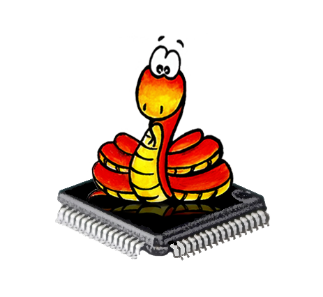

<!-- slide -->
{:width="342px" height="342px"}
# MicroPython移植简介

by **GumpYang**
<!-- slide -->
# MicroPython简介
* Python的轻量级实现，旨在实现Python 3.4标准
* 支持多种硬件平台，包括单片机、微控制器、开发板等
<!-- slide -->
# MicroPython特点
* 体积小、速度快
* 易于学习和使用
* 支持丰富的库和工具
* 可自己开发接口
<!-- slide -->
# 使用硬件平台
* 假公济私 [FR8008XP](https://www.freqchip.com/fr800x)
* 放弃2021年春节的分支，因为之前移植时有原厂的私有代码
* 重新公开的代码库上重新移植
<!-- slide -->
# 移植步骤
* 参考官网[porting](https://docs.micropython.org/en/latest/develop/porting.htm)
 这里只是生成一个最小环境，可以试一下GCC能否编译
* 选择tag 1.22 
* 从原厂公开的源码[SDK](https://gitee.com/freqchip/fr8000)
 选择串品例程进行移植
<!-- slide -->
# 需要的工具
* 需要一个硬件板，可以官网上购买。
 会讲故事可能免费
* 需要一个交叉编译工具链，[arm-none-eabi-gcc](https://developer.arm.com/downloads/-/arm-gnu-toolchain-downloads)
<!-- slide -->
# 目前进度
* 仅仅完成了[REPL](https://github.com/yangchengwork/micropython_fr8000)
<!-- slide -->
# 感谢
* 原厂的支持，在2021年1月时提供了最初的帮助
* 感谢民革，第一次移植时很多细节需要请教他
* 感谢但老师，没有他的逼娼为良，不会再次动手
* 感谢[SZDIY](https://szdiy.org/)
<!-- slide -->